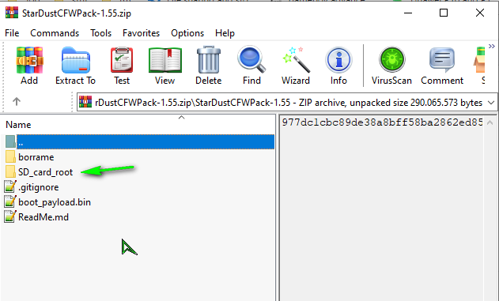
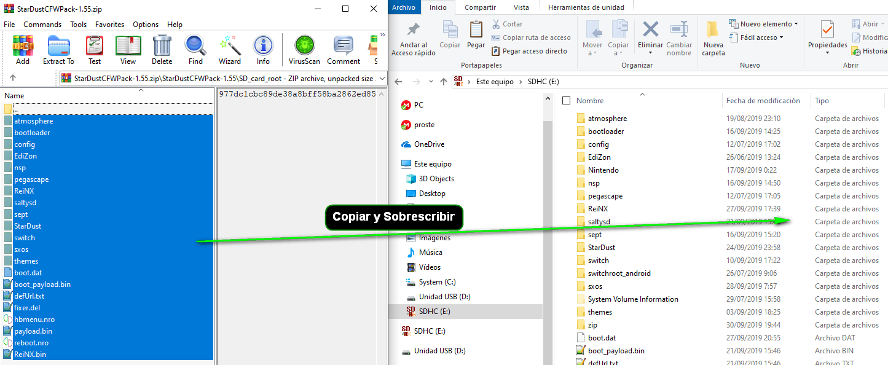
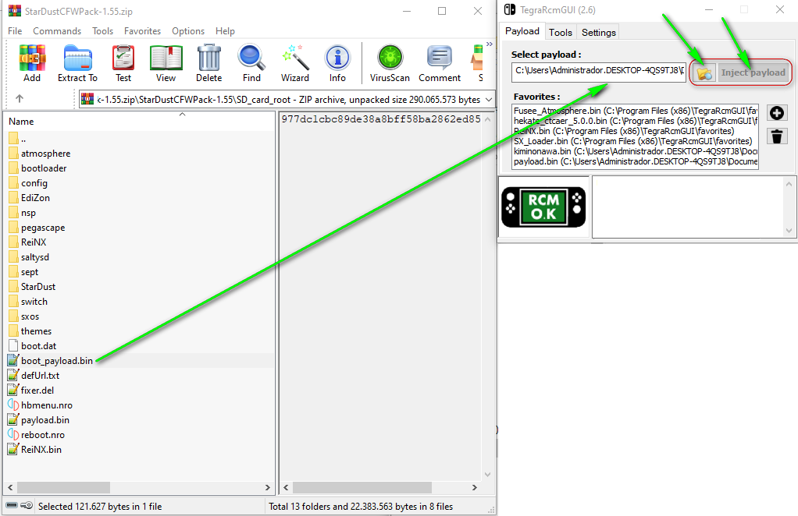

StarDustCFWPack
## Guia Para novatos

* 1.- Descargar el ultimo lanzamiento estable [Aqui](https://github.com/StarDustCFW/StarDustCFWPack/releases/latest)

* 2.- Abrir el comprimido

Copiar Y sobrescribir el contenido de **SD_card_root** en la sd 

* 3.- Siempre usa [boot_payload.bin](https://github.com/Kronos2308/StarDustCFWPack/blob/master/borrame/boot_payload.bin?raw=true) para arracar con [TegraRcmGUI](https://github.com/eliboa/TegraRcmGUI/releases/latest) u otro injector como RCMloader,Rekado...
* * Este payload nunca cambia sera el mismo hoy y mañana, su objetivo: arrancar StarDust Correctamente

 3a.-Si usas R4s como yo, usa este [CURRENT.UF2](https://github.com/StarDustCFW/StarDustCFWPack/blob/master/borrame/CURRENT.UF2?raw=true) en el dongle. instrucciones [Aqui](http://bit.ly/2tLBTua).

3b.-Para RCM loader, copia [boot_payload.bin](https://github.com/Kronos2308/StarDustCFWPack/blob/master/borrame/PAYLOAD.BIN?raw=true) en /ATMOPHERE_HEKATE/PAYLOAD.BIN dentro del dongle sobrescribiendo, luego selecsiona el color AZUL 
<a href="https://es.aliexpress.com/item/4000406540765.html?spm=a2g0o.productlist.0.0.11af28b8SIiAsF&algo_pvid=acdccb2e-5226-4aa3-8998-908524c71a79&algo_expid=acdccb2e-5226-4aa3-8998-908524c71a79-0&btsid=bd7c91ef-0833-4837-a0df-243f0b05ce1c&ws_ab_test=searchweb0_0,searchweb201602_9,searchweb201603_53">  </a >

4.- Escoje una de las opciones de boot.

### Videos Recomendados

[Tutorial de emunand](https://youtu.be/xyzpPqgWRaw)

[Borrar Actualizasion pendiente](https://youtu.be/SRb1joLdhD8)

[Arrancar sin Dongle](https://youtu.be/nD-GbkGiVrs)

[Android en Nintendo Switch](https://youtu.be/_eRYFteUd0U)

### [My canal](https://www.youtube.com/channel/UC0bSZcylREueGQmCM5mksNg) 

