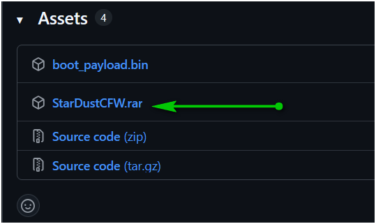
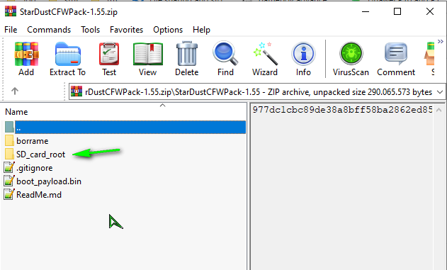
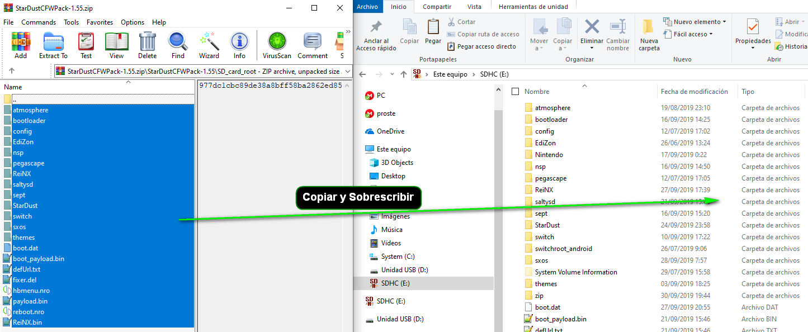
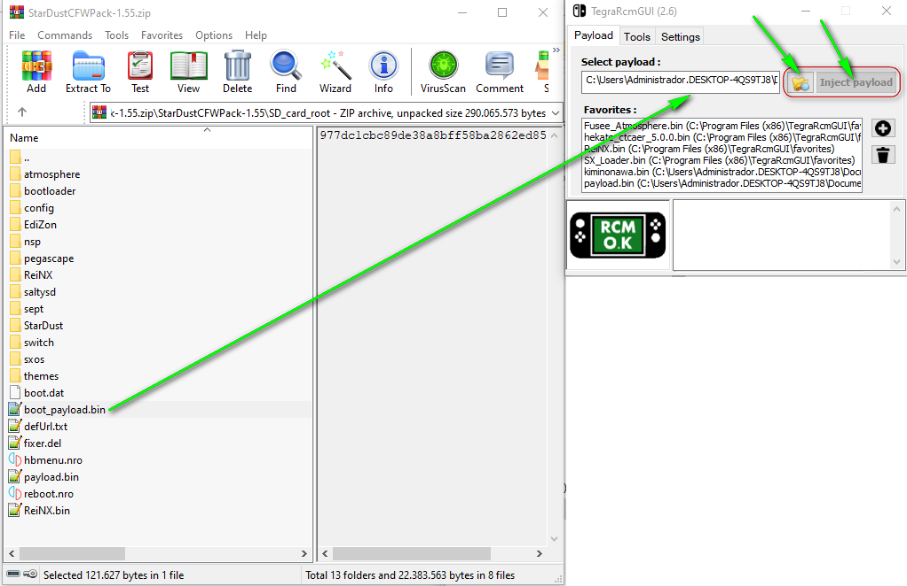
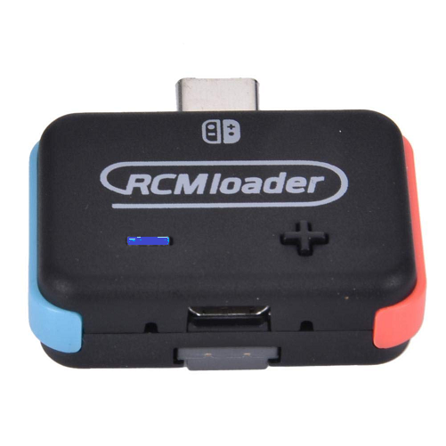

<a href="https://discord.io/myrincon">  </a >

StarDustCFWPack
## Guide for newbies

* 1.- Download the latest Stable Release [Here](https://github.com/StarDustCFW/StarDustCFWPack/releases/latest) 

* 2.- Open compressed file

Copy and overwrite the contents of **SD_card_root** in the SD

* 3.- Always use [boot_payload.bin](https://github.com/Kronos2308/StarDustCFWPack/blob/master/borrame/Payload-Forwarder.bin?raw=true) to drag with [TegraRcmGUI](https://github.com/eliboa/TegraRcmGUI/releases/latest) or other injector like RCMloader, Rekado ...
* * This payload never changes will be the same today and tomorrow, Its objective, Start StarDustCFWpack Correctly

 3a.-If you use R4s like me, use this [CURRENT.UF2](https://github.com/StarDustCFW/StarDustCFWPack/blob/master/borrame/CURRENT.UF2?raw=true) in the dongle. instructions [Here](http://bit.ly/2tLBTua).

3b.-For RCM loader, copy [boot_payload.bin](https://github.com/Kronos2308/StarDustCFWPack/blob/master/borrame/Payload-Forwarder.bin?raw=true) over /ATMOPHERE_HEKATE/PAYLOAD.BIN in the Dongle, Then select the Blue color

4.- Choose one of the boot options.

### Recommended Videos

[Emunand Tutorial](https://youtu.be/xyzpPqgWRaw)

[Delete Pending Update](https://youtu.be/SRb1joLdhD8)

[Boot without Dongle](https://youtu.be/nD-GbkGiVrs)

[Android on Nintendo Switch](https://youtu.be/_eRYFteUd0U)

### [My channel](https://www.youtube.com/channel/UC0bSZcylREueGQmCM5mksNg)
