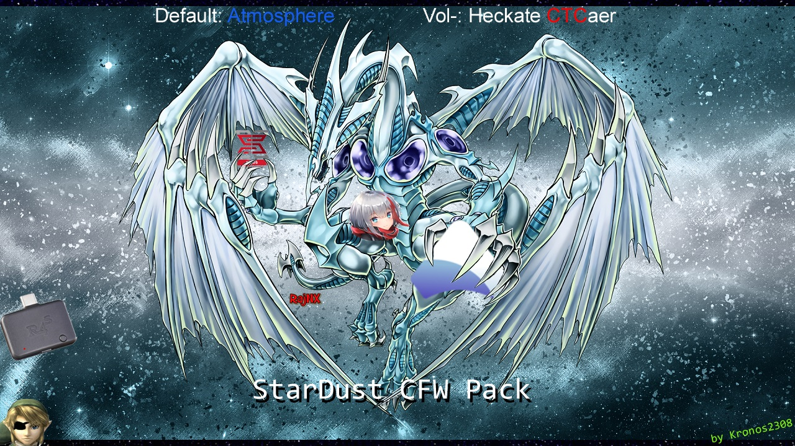
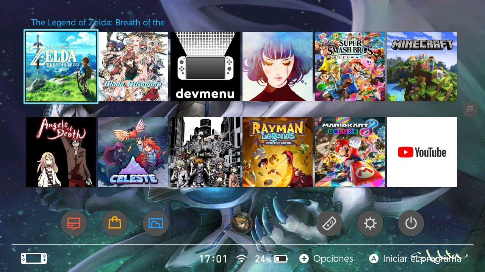

# StarDustCFWPack
StarDust es un pack con los cfw actuales

configurado para convivir bien entre si

Atmosphere, ReiNX, SX OS

Con una interfaz comoda

Agrega también las app mas básicas para empezar

Instalación
=============
1.- Descarga ( https://github.com/Kronos2308/StarDustCFWPack/releases ).

2.- Extraer y sobrescribir todo en la micro SD

3.- Injectar payload.bin en la consola 

4.- Escoje una de las opciones de boot 

https://discordapp.com/invite/kscctYj

