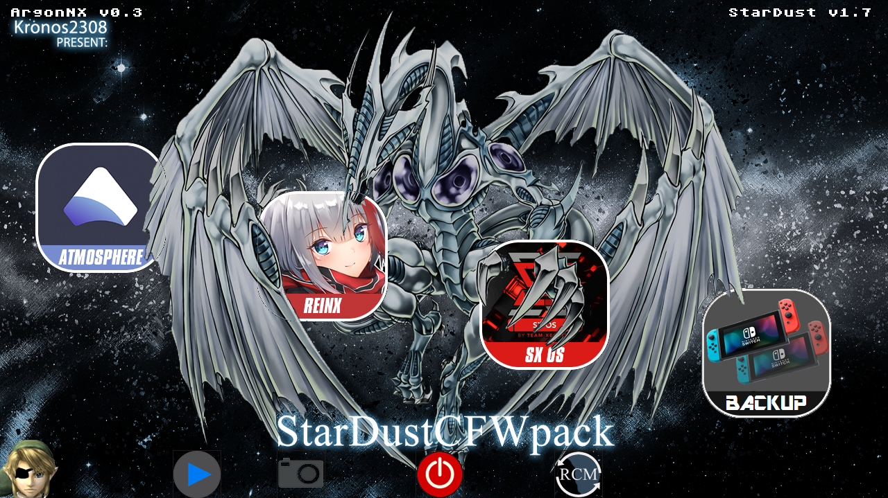

# StarDustCFWPack
StarDust es un pack con los cfw actuales--------------------StarDust is a pack with the current cfw      

configurado para convivir bien entre si---------------------configured to live well together        

Atmosphere, ReiNX, SX OS------------------------------------Atmosphere, ReiNX, SX OS

Con una interfaz comoda-------------------------------------With a comfortable interface

Agrega también las app mas básicas para empezar-------------Also add the most basic app to start

Instalación
=============
1.- Descarga el ultimo lanzamiento en [Aqui](https://github.com/Kronos2308/StarDustCFWPack/releases).

2.- Extraer y sobrescribir todo en la micro SD

3.- Injectar payload.bin en la consola 

  3a.-Si usas el PC recomiendo usar siempre este [payload-forwader](https://github.com/Kronos2308/StarDustCFWPack/blob/master/payload-forwader.bin?raw=true)

  3b.-Si usas R4s como yo, usa este .uf2 en el dongle https://bit.ly/2zsClBu
  instrucciones aqui http://bit.ly/2tLBTua

4.- Escoje una de las opciones de boot 

5.- [Stardust-Toolkit](https://github.com/Kronos2308/StarDust-Toolkit/releases)

====================================================

1.- Download the last release in [Here](https://github.com/Kronos2308/StarDustCFWPack/releases)

2.- Extract and overwrite everything in the micro SD

3.- Injectar payload.bin in the console

  3a.- If you use the PC I recommend always using this [payload-forwader](https://github.com/Kronos2308/StarDustCFWPack/blob/master/payload-forwader.bin?raw=true)

  3b.-If you use R4s like me, use this .uf2 on the dongle https://bit.ly/2zsClBu
  instructions here http://bit.ly/2tLBTua

4.- Choose one of the boot options

5.- [Stardust-Toolkit](https://github.com/Kronos2308/StarDust-Toolkit/releases)

**Credits**

https://github.com/Atmosphere-NX/Atmosphere

https://github.com/Reisyukaku/ReiNX

https://github.com/Guillem96/argon-nx

Retrogamer 74

PricelessTwo2

And special thanks to Rumba the retrogamer_74 dog

# Forks

https://github.com/Kronos2308/argon-nx

https://github.com/Kronos2308/Atmosphere

https://github.com/Kronos2308/hekate

https://github.com/Kronos2308/incognito

Mas informacion Aqui esta mi Discord

# https://discordapp.com/invite/kscctYj

