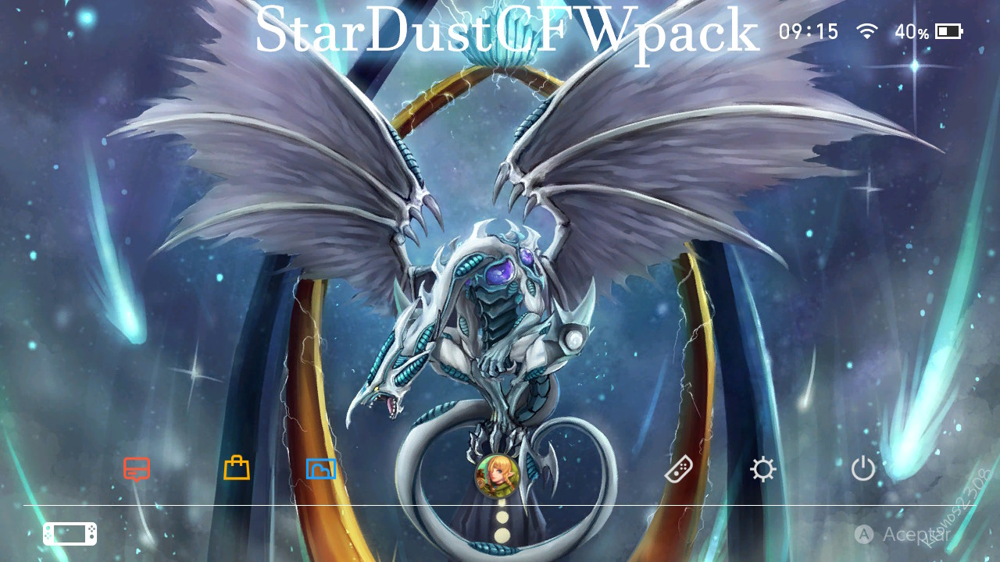

# StarDustCFWPack

StarDust es un pack con los cfw actuales--------------------StarDust is a pack with the current cfw      

configurado para convivir bien entre si---------------------configured to live well together        

Atmosphere, SXOS-----------------------------------Atmosphere, SXOS

Con una interfaz comoda------------------------------------With a comfortable interface

Agrega también las app mas básicas para empezar--------Also add the most basic app to start

Instalación
=============
## [Guía Detallada](Guia.md)

## [Detailed Guide](Guide.md)

**Credits**

https://github.com/Atmosphere-NX/Atmosphere

https://github.com/Reisyukaku/ReiNX

https://github.com/Guillem96/argon-nx

Retrogamer 74

D3fau4

PricelessTwo2

And special thanks to Rumba the retrogamer_74 dog

# Forks

https://github.com/StarDustCFW/StarDust-Bootmenu

https://github.com/StarDustCFW/Atmosphere

https://github.com/StarDustCFW/hekate

https://github.com/StarDustCFW/incognito

https://github.com/StarDustCFW/Lockpick_RCM

Mas informacion Aqui esta mi Discord

# [My Discord](https://discord.io/myrincon)

### [My Youtube](https://www.youtube.com/channel/UC0bSZcylREueGQmCM5mksNg)

