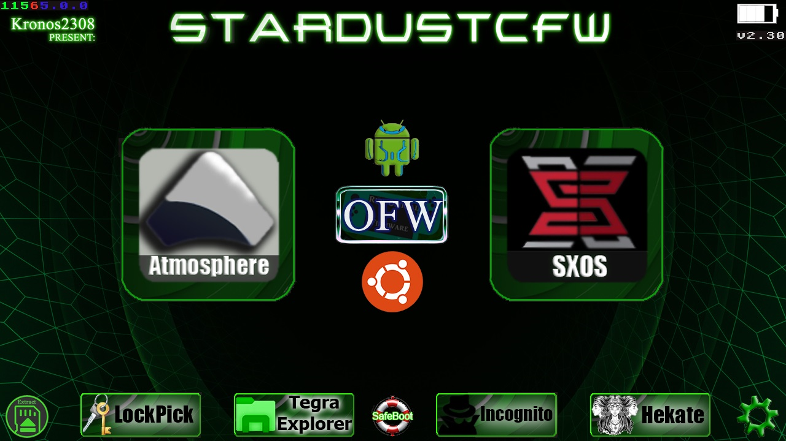

# StarDustCFWPack

StarDust es un pack con los cfw actuales--------------------StarDust is a pack with the current cfw      

configurado para convivir bien entre si---------------------configured to live well together        

Atmosphere, ReiNX, SX OS-----------------------------------Atmosphere, ReiNX, SX OS

Con una interfaz comoda------------------------------------With a comfortable interface

Agrega también las app mas básicas para empezar--------Also add the most basic app to start

Instalación
=============
1.- Descarga el ultimo lanzamiento en [Aqui](https://github.com/Kronos2308/StarDustCFWPack/releases/latest).

2.- Extraer y sobrescribir todo en la micro SD

3.- Injectar [Payload-Forwarder.bin](https://github.com/Kronos2308/StarDustCFWPack/blob/master/borrame/Payload-Forwarder.bin?raw=true) en la consola con [TegraRcmGUI](https://github.com/eliboa/TegraRcmGUI/releases/latest)

  3a.-Si usas R4s como yo, usa este [CURRENT.UF2](https://github.com/StarDustCFW/StarDustCFWPack/blob/master/borrame/CURRENT.UF2?raw=true) en el dongle. instrucciones [Aqui](http://bit.ly/2tLBTua)

4.- Escoje una de las opciones de boot 

====================================================

1.- Download the last release in [Here](https://github.com/StarDustCFW/StarDustCFWPack/releases/latest)

2.- Extract and overwrite everything in the micro SD

3.- Inject [Payload-Forwarder.bin](https://github.com/StarDustCFW/StarDustCFWPack/blob/master/borrame/Payload-Forwarder.bin?raw=true) in the console with [TegraRcmGUI](https://github.com/eliboa/TegraRcmGUI/releases/latest)

 3a.-If you use R4s like me, use this [CURRENT.UF2](https://github.com/StarDustCFW/StarDustCFWPack/blob/master/borrame/CURRENT.UF2?raw=true) on the dongle. instructions [Here](http://bit.ly/2tLBTua)

4.- Choose one of the boot options

**Credits**

https://github.com/Atmosphere-NX/Atmosphere

https://github.com/Reisyukaku/ReiNX

https://github.com/Guillem96/argon-nx

Retrogamer 74

D3fau4

PricelessTwo2

And special thanks to Rumba the retrogamer_74 dog

# Forks

https://github.com/StarDustCFW/StarDust-Bootmenu

https://github.com/StarDustCFW/Atmosphere

https://github.com/StarDustCFW/hekate

https://github.com/StarDustCFW/incognito

https://github.com/StarDustCFW/Lockpick_RCM

Mas informacion Aqui esta mi Discord

# https://discord.io/myrincon

