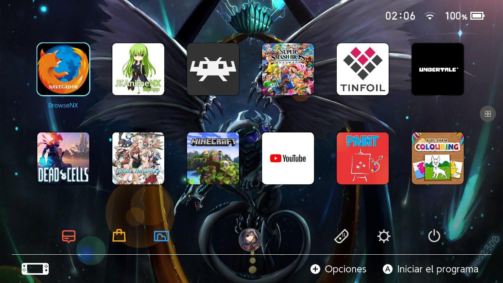

<a href="https://discord.io/myrincon"></a> >>[Read in English](ReadMeEN.md)<< >> **[Parche Beta](https://github.com/StarDustCFW/StarDustCFWPack/archive/refs/heads/master.zip)**<<
# StarDustCFWPack (STD)<a href="https://github.com/StarDustCFW/StarDustCFWPack/releases/latest"></a><br>
#### Lanzamientos [SuperComprimidos](https://github.com/StarDustCFW/StarDustCFWPack/actions) Pa internet d palo
## Soporte 13.1.0 e inferior
### STD es un pack con los cfw actuales, configurado para convivir bien entre si, Atmosphere, SXOS, Android. Con una interfaz comoda y facil de usar, agrega también las app mas básicas para empezar<br>
<a href="https://discord.io/myrincon"></a>


Instalación
=============
## [Guía Detallada](Guia.md) <br>
## [Video, Explicación](https://youtu.be/YcJRgSNIrpo) <br>

<a href="https://discord.io/myrincon"></a>
<a href="https://discord.io/myrincon"></a>

**Credits**<br>
[Atmosphere](https://github.com/Atmosphere-NX/Atmosphere)<br>
[ReiNX](https://github.com/Reisyukaku/ReiNX)<br>
[argon-nx](https://github.com/Guillem96/argon-nx)<br>
D3fau4<br>
PricelessTwo2<br>
Retrogamer 74 (el quejas)<br>

# [Forks](https://github.com/StarDustCFW) <br>

Mas informacion Aqui esta mi Discord<br>
# [My Discord](https://discord.io/myrincon)<br>
### [My Youtube](https://www.youtube.com/channel/UC0bSZcylREueGQmCM5mksNg?sub_confirmation=1)


<details>
  <summary>INDEX</summary>
 
```css
  HEAD>
 CFW>
  OK Atmosphere-NX_Atmosphere - 1.2.1
 NRO>
  OK HamletDuFromage_aio-switch-updater - 2.16.0
  OK Cpasjuste_pplay - v3.5
  OK J-D-K_JKSV - 09/01/2021
  OK rdmrocha_linkalho - v1.0.5
  OK Huntereb_Awoo-Installer - 1.3.4
  OK exelix11_SwitchThemeInjector - v-4.6.2-fw13.0
  OK XorTroll_Goldleaf - 0.9
 Servisios>
  OK ndeadly_MissionControl - v0.6.0
  OK spacemeowx2_ldn_mitm - v1.10.0
  OK XorTroll_emuiibo - 0.6.3
  OK cathery_sys-con - v0.6.4
  OK retronx-team_sys-clk - 1.0.1
  OK WerWolv_nx-ovlloader - v1.0.6
 Overlay>
  OK WerWolv_ovl-sysmodules - v1.2.2
  OK HookedBehemoth_sys-tune - v1.2.1
  OK HeadpatServices_sys-clk-Overlay - v1.1
  OK masagrator_Status-Monitor-Overlay - 0.6.3
  OK nedex_QuickNTP - 1.2.1
  OK WerWolv_Tesla-Menu - v1.1.4
 Payloads>
  OK CaramelDunes_prodinfo_gen - v0.3.4
  OK shchmue_Lockpick_RCM - v1.9.6
  OK suchmememanyskill_TegraExplorer - 4.0.1
  OK CTCaer_hekate - v5.6.5
 Data>
  OK ITotalJustice_patches - 13.1.0-1.2.1
END>

 ```
</details>

