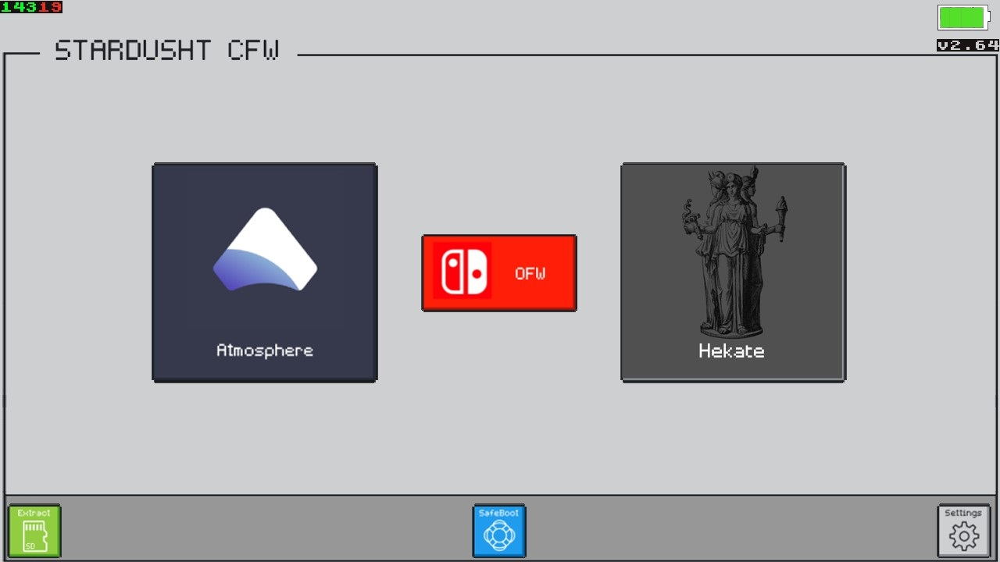

 >>[Leer en español](ReadMe.md)<< >> **[Beta Pack](https://github.com/StarDustCFW/StarDustCFWPack/archive/refs/heads/master.zip)**<<
# StarDustCFWPack (STD) 
#### Release [Compressed](https://github.com/StarDustCFW/StarDustCFWPack/actions)
## Support 14.1.0 and Below
### STD is a pack with the current cfw, configured to live well together, Atmosphere, SXOS, Android. With a comfortable interface, also add the most basic apps to start 

Instalation
=============
## [Detailed Guide](Guide.md)  
## [Video](https://youtu.be/YcJRgSNIrpo)  

**Credits** 
[Atmosphere](https://github.com/Atmosphere-NX/Atmosphere) 
[ReiNX](https://github.com/Reisyukaku/ReiNX) 
[argon-nx](https://github.com/Guillem96/argon-nx) 
D3fau4 
PricelessTwo2 
Retrogamer 74 (el quejas) 

# [Forks](https://github.com/StarDustCFW)  

For more info join to My Discord chat 
# [My Discord](https://discord.io/myrincon) 
### [My Youtube](https://www.youtube.com/channel/UC0bSZcylREueGQmCM5mksNg?sub_confirmation=1)

